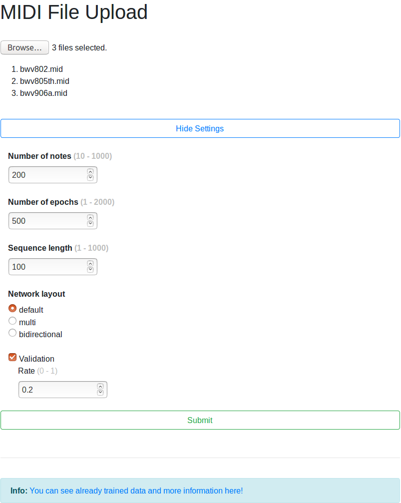
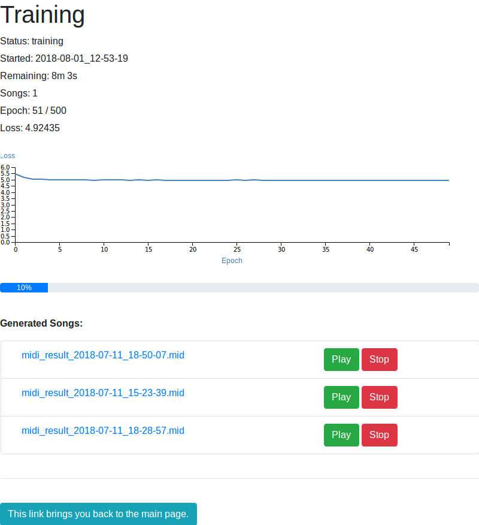

# Server

This server is using flask to provide a simple interface to upload files and train the network.

Once the dependencies are installed and the server is running,
you will be able to access the website at:

```
localhost:8080/
```

<br/>

## Tools Used
- [Flask](http://flask.pocoo.org/)
- [MIDIjs](http://www.midijs.net/) from midijs.net
- [jQuery](https://github.com/jquery/jquery)
- [Bootstrap](https://github.com/twbs/bootstrap)
- [d3](https://github.com/d3/d3)
- [socket.io](https://github.com/socketio/socket.io)

To install all of the dependencies needed to run the python application,
simply use [pip](https://pypi.org/) with:

```
pip install -r requirements.txt
```


<br/>

## Known Problems

#### Fix [Cuda Problem](https://stackoverflow.com/questions/42013316/after-building-tensorflow-from-source-seeing-libcudart-so-and-libcudnn-errors) (Linux)
Type in terminal before executing the program

```
export PATH=/usr/local/cuda/bin${PATH:+:${PATH}}
export LD_LIBRARY_PATH=/usr/local/cuda/lib64${LD_LIBRARY_PATH:+:${LD_LIBRARY_PATH}}
```

If you have trouble finding the correct versions, [see here](https://stackoverflow.com/questions/48575900/how-to-install-tensorflow-gpu-with-cuda8-0).  
For example: tensorflow-gpu-1.4.1 uses CUDA-8.0 and CUDNN-6.0


<br/>

## Useful Links
- [Jinja2 Whitespace Control in Flask](https://pythonadventures.wordpress.com/2015/01/29/flask-jinja2-dont-print-empty-lines/)
- [Flask Socket-IO](https://flask-socketio.readthedocs.io/en/latest/)
- [Flask Request Attributes](https://tedboy.github.io/flask/generated/generated/flask.Request.html#attributes)
- [SocketIO emit from another thread/context](https://stackoverflow.com/questions/31647081/flask-python-and-socket-io-multithreading-app-is-giving-me-runtimeerror-work)


<br/>

## The main page will look similar to this image:




<br/>

## The training page will look similar to this image:


